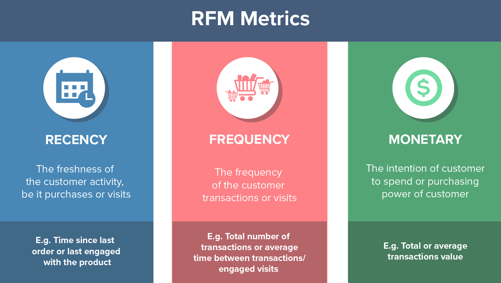

# Customer-Segmentation
Using unsupervised ML for E-commerce customer segmentation

### Context
Typically e-commerce datasets are proprietary and consequently hard to find among publicly available data. However, The UCI Machine Learning Repository has made this dataset containing actual transactions from 2010 and 2011. The dataset is maintained on their site, where it can be found by the title "Online Retail".

**Variable Description**

`InvoiceNo`: Invoice number that consists 6 digits. If this code starts with letter 'c', it indicates a cancellation. 
`StockCode`: Product code that consists 5 digits. 
`Description`: Product name. 
`Quantity`: The quantities of each product per transaction. 
`InvoiceDate`: Represents the day and time when each transaction was generated. 
`UnitPrice`: Product price per unit. 
`CustomerID`: Customer number that consists 5 digits. Each customer has a unique customer ID. 
`Country`: Name of the country where each customer resides. 

